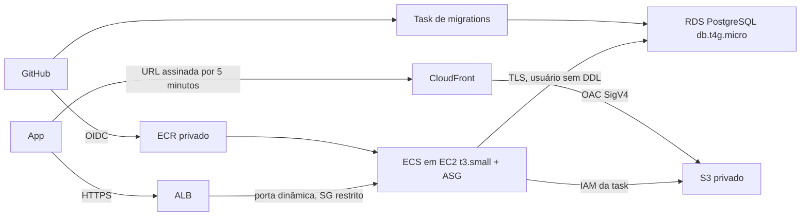

# Broto — infraestrutura AWS

Terraform do backend [broto-api-golang](https://github.com/JeanRoque0/broto-api-golang), separado da aplicação. Região padrão **sa-east-1**. Não há credenciais, chaves privadas ou valores de secrets neste repositório.

## Arquitetura



A task da API reserva **2048 CPU / 780 MiB**, com reserva de memória de 640 MiB, `GOMEMLIMIT=600MiB`, pool de 4 conexões e limite de 16 requisições simultâneas. Cada task ocupa a capacidade de CPU de uma t3.small. EC2 é burstable: 2 vCPU não significam uso máximo sustentado indefinidamente. Créditos ficam em modo Standard para evitar cobrança de excedente.

O padrão econômico é 1 task (min/max 1), RDS Single-AZ e hosts com IPv4 público, **sem SSH e sem entrada pública direta**: só o ALB alcança portas dinâmicas das tasks bridge. Não há NAT, sub-redes privadas de compute nem Route53. RDS fica em sub-redes isoladas; S3 usa gateway endpoint. IMDSv2 obrigatório, bloqueio de IMDS no Docker, disco EBS criptografado, SSM e contêiner sem root/capabilities, com filesystem somente leitura.

Autoscaling de capacidade ECS/EC2 permanece para reposição e deploy; `max_tasks` pode ser aumentado depois de medir a carga. Retiramos a política por requests/minuto para não escalar com tráfego pequeno; a política de CPU permanece. Uma EC2 adicional pode ser necessária temporariamente para migration/rolling deploy. Hosts recebem IP dinâmico: se Brevo exigir allowlist, autorize o IP corrente e revise-o após substituições; este desenho sem NAT não oferece IP de saída fixo. `min_tasks=2`, `max_tasks>=2` e `rds_multi_az=true` aumentam disponibilidade e preço.

### Sem domínio e com Cloudflare depois

`api_domain` e `origin_certificate_arn` podem ficar vazios. O Terraform não solicita certificado nem cria registros DNS. O hostname do ALB aparece no output `alb_hostname`: apenas GET/HEAD de `/livez`, `/readyz` e `/healthz` são encaminhados por HTTP. Outras rotas retornam 503 `https_configuration_pending`, para não disponibilizar login/dados sem TLS.

Quando tiver o domínio, crie certificado para ele no ACM em sa-east-1: certificado público com validação DNS manual na Cloudflare, ou certificado Cloudflare Origin CA importado fora do Terraform. Informe `api_domain` e `origin_certificate_arn`; o próximo apply habilita 443 e redireciona HTTP. Crie CNAME proxied na Cloudflare apontando para `alb_hostname`, use **Full (strict)** e desative cache das rotas `/v1/*`. O certificado da borda Cloudflare não configura automaticamente TLS entre Cloudflare e ALB. Não use Flexible para autenticação. Atualize SITE_URL/CORS e faça novo deploy para atualizar as variáveis das tasks.

CloudFront usa seu domínio padrão `*.cloudfront.net` (dispensa outro domínio/certificado), OAC e um grupo de chave pública RSA-2048. O S3 não é público. A API só assina arquivos existentes do usuário autenticado. URLs expiram em 300 segundos, assim como o TTL máximo do cache. O navegador recebe `private, no-store`. Exclusão não revoga instantaneamente URLs já emitidas: uma cópia na borda pode continuar disponível até esse prazo. Versões anteriores do S3 são removidas após 7 dias; backups também podem reter dados apagados.

## Preparar e implantar

1. Terraform >=1.10, AWS CLI autenticada e permissão de criação dos recursos. Execute `aws sts get-caller-identity` e confira a conta. O provisionamento cobra EC2/RDS/ALB mesmo antes de configurar o domínio.
2. Crie um bucket de estado, com nome globalmente único:
   ```sh
   terraform -chdir=bootstrap init
   terraform -chdir=bootstrap plan -var='state_bucket_name=SEU_BUCKET_UNICO'
   terraform -chdir=bootstrap apply -var='state_bucket_name=SEU_BUCKET_UNICO'
   ```
   O bootstrap tem estado local: guarde cópia criptografada fora do Git. Na implantação atual há uma cópia no bucket de estado em `bootstrap/state-backup.json`; atualize-a se modificar o bootstrap. O bucket tem versionamento, bloqueio público, TLS obrigatório e `prevent_destroy`. Seu conteúdo não deve ser removido durante a vida da infraestrutura.
3. Copie `aws/backend.hcl.example` para `aws/backend.hcl` e informe o bucket. Backend S3 com `use_lockfile=true`, sem DynamoDB. Copie `aws/terraform.tfvars.example` para `aws/terraform.tfvars`. O repositório já está preenchido; domínio e certificado podem ficar vazios. Informe remetente verificado. Enquanto o frontend não tiver URL, SITE_URL/CORS usam `https://example.invalid`, domínio reservado que não libera um frontend real.
4. Gere o par de assinatura **fora do Terraform**:
   ```sh
   umask 077
   openssl genrsa -out cloudfront-private.pem 2048
   openssl rsa -in cloudfront-private.pem -pubout -out cloudfront-public.pem
   ```
   Copie apenas o conteúdo de `cloudfront-public.pem` para `cloudfront_public_key_pem`. A chave privada irá para Secrets Manager. Não utilize `tls_private_key` no Terraform: gravaria a chave no estado.
5. Execute `terraform -chdir=aws init -backend-config=backend.hcl`, `terraform -chdir=aws plan` e revise os custos antes do `apply`. Mantenha `deploy_enabled=false` no primeiro apply: o serviço nasce com zero tasks, mas RDS e ALB **já cobram** (EC2 começa a cobrar quando a primeira task solicita capacidade). O ECR inicialmente estará vazio. Se a conta já tiver OIDC do GitHub, informe `github_oidc_provider_arn` para reutilizá-lo.
6. Preencha o secret cujo ARN está em `application_secret_arn` com um objeto JSON contendo estas chaves:
   - `SIGNING_KEY`: aleatória, pelo menos 32 caracteres.
   - `ANTHROPIC_API_KEY`, `SMTP_USER`, `SMTP_PASSWORD`.
   - `GOOGLE_CLIENT_SECRET`: pode ser vazio enquanto `google_enabled=false`.
   - `CLOUDFRONT_PRIVATE_KEY`: PEM privado correspondente ao público, com quebras de linha preservadas no JSON.
   Use console ou arquivo local protegido e `aws secretsmanager put-secret-value --secret-id ARN --secret-string file://application.secrets.json`; nunca coloque o JSON na linha de comando, Git ou tfvars. O pipeline cria uma senha aleatória separada para `database-app`; a senha administrativa do RDS é gerenciada pela AWS. Secrets são injetados ao iniciar a task; rotação exige novas tasks.
7. No GitHub, autentique `gh auth login` para publicar os commits locais. Respeite a política de privacidade do backend. Crie o environment **production** no repositório da API e restrinja deploy à branch **main**. Copie os valores de `terraform -chdir=aws output -json github_actions_variables` para variables desse environment. Configure **DEPLOY_ENABLED=true como repository variable** só depois de concluir os passos anteriores. O job de deploy fica desativado até lá; o commit inicial não provisiona nem publica imagens por conta própria.
8. Execute o workflow Build and deploy. Ele roda testes, publica/reutiliza imagem imutável `git-SHA`, usa digest, cria a senha do usuário da aplicação, executa migrations com credencial administrativa e atualiza ECS. Faz verificação explícita de rollback. Não usa access keys permanentes no GitHub.
9. Após o primeiro deploy saudável, mude `deploy_enabled=true` no Terraform e aplique para ativar autoscaling. O Terraform ignora revisões de task/desired count gerenciadas pelo pipeline/ECS. ASG começa com min/desired 0 para que instâncias só nasçam após associar o capacity provider; o primeiro run-task inicia capacidade automaticamente (ECS pode iniciar dois hosts ao sair de zero). ASG permite até `max_tasks+1` hosts para acomodar migration/rolling deploy. Esses hosts extras geram custo temporário; 1 EC2 é a estimativa de repouso.

## Operação e limitações

- RDS tem TLS obrigatório, backups de 1 dia (`backup_retention_days`; a conta Free rejeitou 7 dias), proteção contra exclusão, snapshot final e storage inicial 20 GiB com autoscaling até 50 GiB. O usuário `broto_app` tem DML, não é dono das tabelas; schema só muda na task migration. A conexão verifica hostname/cadeia TLS com bundle RDS incluído na imagem.
- Migrations são imutáveis e devem ser compatíveis com a versão anterior durante rolling deploy. Rollback da aplicação não desfaz migrations. Para retornar a uma versão antiga, use seu digest ECR conhecido e o script de deploy após avaliar compatibilidade do schema.
- ECR mantém 10 releases e remove untagged após 14 dias. Guarde por mais tempo imagens necessárias à sua política de rollback.
- Logs API/migration retidos por 7 dias; alarmes para memória/disco RDS e ausência de hosts saudáveis. Configure `alarm_email` e confirme assinatura SNS. Não habilitamos logs de acesso ALB/CloudFront para evitar gravar query strings com credenciais temporárias; WAF, Container Insights e RDS Proxy não estão incluídos no custo.
- RDS exporta logs PostgreSQL para grupo com retenção de 7 dias; monitore o volume. CloudTrail de conta não é substituído por este projeto.
- AMI AL2023 otimizada ECS vem do SSM. Atualizar o launch template afeta novas instâncias; planeje rotação/drenagem dos hosts existentes para aplicar patches. Não há rotina automática de patch/reboot.
- Teto permitido `max_tasks=4` protege o RDS micro (o padrão atual é 1): até 8 tasks durante rollout x 4 conexões = 32, mais migration/admin abaixo das 50 configuradas. Redimensione banco/pools antes de aumentar. Testes de carga são necessários para dimensionar usuários/IA.
- S3 não participa da transação PostgreSQL. Há compensação e fila durável de exclusão; queda do processo entre upload e commit ainda pode deixar objeto órfão. Planeje reconciliação por inventário antes de escalar grandes volumes.
- Rate limit em memória vale por réplica; intervalo SMTP é persistido no PostgreSQL. Para limite de abuso global rigoroso será necessário controle compartilhado/WAF.

## Validar sem provisionar

```sh
terraform fmt -check -recursive .
terraform -chdir=aws init -backend=false
terraform -chdir=aws validate
terraform -chdir=aws test
terraform -chdir=bootstrap init -backend=false
terraform -chdir=bootstrap validate
```

Os testes usam `mock_provider`: os `apply` dentro de testes **não chamam AWS nem criam recursos**. Cobrem dimensões, bootstrap, banco privado/criptografado, contêiner, IMDS e variante HTTPS/HA. Não substituem um deploy real, validação das permissões IAM na conta ou teste ponta a ponta da CDN. Veja [custos mensais](CUSTOS.md).

## Smoke test real da CDN

`python3 scripts/test-cdn.py --private-key /caminho/privado/cloudfront-private.pem` usa a AWS configurada para subir um objeto descartável, validar leitura assinada e negar acesso público/expirado/adulterado. Remove a versão do objeto ao terminar; exige permissão de DeleteObjectVersion para a limpeza. Gera algumas requisições AWS cobradas por uso. A chave privada da implantação atual está também no Secrets Manager; não a coloque no repositório.

O plano Free desta conta rejeitou retenção de backup de 7 dias; a implantação usa 1 dia e não altera o plano de cobrança. Aumente `backup_retention_days` quando a conta permitir e conforme a recuperação exigida.
